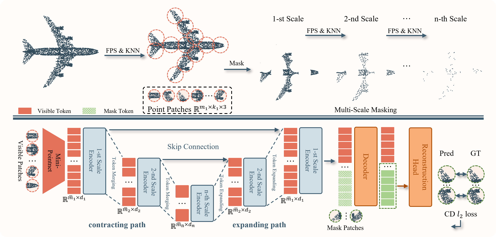
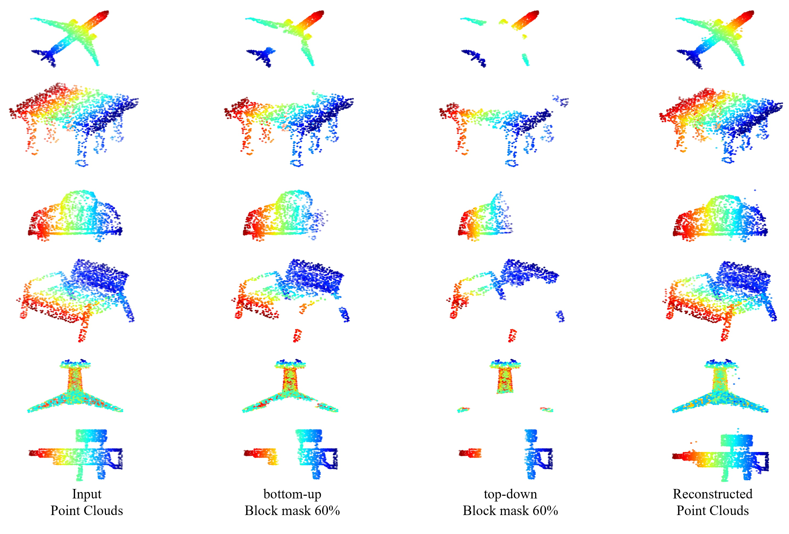

# Point-UMAE

## Point-UMAE: Unet-like Masked Autoencoders for Point Cloud Self-supervised Learning

In this paper, we introduce Point-UMAE, an innovative framework for point cloud processing. This method adopts a top-down masking strategy, ensuring consistency in multi-scale masking, and leverages the advantages of a multi-scale architecture by successfully transferring the Unet-like encoder architecture in both pre-training and fine-tuning stages. Point-UMAE demonstrates competitiveness in various downstream tasks, including but not limited to 3D shape classification, part segmentation, and object detection.
<div  align="center">    
 
</div>

## 1. Requirements
PyTorch >= 1.7.0 < 1.11.0;
python >= 3.7;
CUDA >= 9.0;
GCC >= 4.9;
torchvision;

```
pip install -r requirements.txt
```

```
# Chamfer Distance & emd
cd ./extensions/chamfer_dist
python setup.py install --user
cd ./extensions/emd
python setup.py install --user
# PointNet++
pip install "git+https://github.com/erikwijmans/Pointnet2_PyTorch.git#egg=pointnet2_ops&subdirectory=pointnet2_ops_lib"
# GPU kNN
pip install --upgrade https://github.com/unlimblue/KNN_CUDA/releases/download/0.2/KNN_CUDA-0.2-py3-none-any.whl
```

## 2. Datasets

We use ShapeNet, ScanObjectNN, ModelNet40 and ShapeNetPart in this work. See [DATASET.md](./DATASET.md) for details.

## 3. Point-MAE Models
|  Task | Dataset | Config | Acc.       |      
|  ----- | ----- |-----|------------|
|  Pre-training | ShapeNet |[pretrain.yaml](./cfgs/pretrain.yaml)| 93.1%      |
|  Classification | ScanObjectNN |[finetune_scan_hardest.yaml](./cfgs/finetune_scan_hardest.yaml)| 87.0%      |
|  Classification | ScanObjectNN |[finetune_scan_objbg.yaml](./cfgs/finetune_scan_objbg.yaml)| 91.6%      |
|  Classification | ScanObjectNN |[finetune_scan_objonly.yaml](./cfgs/finetune_scan_objonly.yaml)| 89.3%      |
|  Classification | ModelNet40(1k) |[finetune_modelnet.yaml](./cfgs/finetune_modelnet.yaml)| 94.2%      |
| Part segmentation| ShapeNetPart| [segmentation](./segmentation)| 86.1% mIoU |

|  Task | Dataset | Config | 5w10s Acc. (%)| 5w20s Acc. (%)| 10w10s Acc. (%)| 10w20s Acc. (%)|     
|  ----- | ----- |-----|  -----| -----|-----|-----|
|  Few-shot learning | ModelNet40 |[fewshot.yaml](./cfgs/fewshot.yaml)| 97.1 ± 1.9| 98.6 ± 0.7| 92.6 ± 4.0| 95.1 ± 3.0| 

## 4. Point-MAE Pre-training
To pretrain Point-MAE on ShapeNet training set, run the following command. If you want to try different models or masking ratios etc., first create a new config file, and pass its path to --config.

```
CUDA_VISIBLE_DEVICES=<GPU> python main.py --config cfgs/pretrain.yaml --exp_name <output_file_name>
```
## 5. Point-MAE Fine-tuning

Fine-tuning on ScanObjectNN, run:
```
CUDA_VISIBLE_DEVICES=<GPUs> python main.py --config cfgs/finetune_scan_hardest.yaml \
--finetune_model --exp_name <output_file_name> --ckpts <path/to/pre-trained/model>
```
Fine-tuning on ModelNet40, run:
```
CUDA_VISIBLE_DEVICES=<GPUs> python main.py --config cfgs/finetune_modelnet.yaml \
--finetune_model --exp_name <output_file_name> --ckpts <path/to/pre-trained/model>
```
Voting on ModelNet40, run:
```
CUDA_VISIBLE_DEVICES=<GPUs> python main.py --test --config cfgs/finetune_modelnet.yaml \
--exp_name <output_file_name> --ckpts <path/to/best/fine-tuned/model>
```
Few-shot learning, run:
```
CUDA_VISIBLE_DEVICES=<GPUs> python main.py --config cfgs/fewshot.yaml --finetune_model \
--ckpts <path/to/pre-trained/model> --exp_name <output_file_name> --way <5 or 10> --shot <10 or 20> --fold <0-9>
```
Part segmentation on ShapeNetPart, run:
```
cd segmentation
python main.py --ckpts <path/to/pre-trained/model> --root path/to/data --learning_rate 0.0002 --epoch 300
```

## 6. Visualization

Visulization of pre-trained model on ShapeNet validation set, run:

```
python main_vis.py --test --ckpts <path/to/pre-trained/model> --config cfgs/pretrain.yaml --exp_name <name>
```

<div  align="center">    
 
</div>

## Acknowledgements

Our codes are built upon [Point-MAE](https://github.com/Pang-Yatian/Point-MAE), [Point-M2AE](https://github.com/ZrrSkywalker/Point-M2AE)

## Reference

```
```
